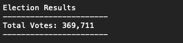
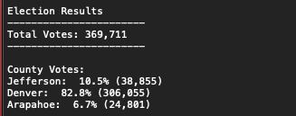
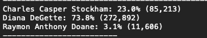
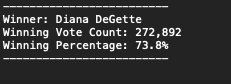
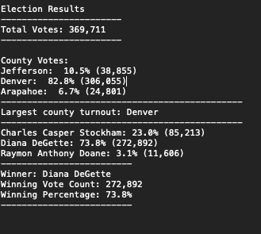

# Election Analysis
Using **Python** to automate the process of analyzing Election results. 
---
## Project Background
In this project we use **Python** to analyze .csv file consisting Colorado Board of Election results. 

1. This csv file consited of candidate names, counties who are being voted for, pretaining Ballot ID's
2. For this project - we formulated a logic that prints out Total votes, Winning candidate, winning county with respect to individual county votes as well as candidate votes.
3. Created a text file that reprensnts a formulated and clean version of the election results.

In the end via this project, we can determine the winning candidate by popular vote, and the winning County.

## Project Method
Create a **Python** script [Pypoll_Challenge.py](Project/PyPoll.py) to go through and parse .**csv file**: [election_results.csv](/Project/election_result.csv), retrieving  and calculating various of election audit metrics.

## Election-Audit Results

1. How many votes were cast in this congressional election?
  - The total Number of votes cast 369,711
  
 
 
2. Provide a breakdown of the number of votes and the percentage of total votes for each county in the precinct.
  - Here is a representation via a png picture, which showcases the number of votes and the percentage of total votes for each county
  
  
 
 
 
3. Which county had the largest number of votes?
  - Denver had the largest votes
  
4. Provide a breakdown of the number of votes and the percentage of the total votes each candidate received.
  - Here is a represenatation via a png picture, which showcases the number of votes and the percentage of the total votes
 
 
 
 
 
5. Which candidate won the election, what was their vote count, and what was their percentage of the total votes?
  
  

## Project Results
Final Project Text file representation

---
We can make conclusions  in [election_analysis.txt](/Project/election_analysis.txt): 
1. The total number of votes cast is *369,711*.
2. The largest county turnout is *Denver, Co* 
3. The winner of election is *Diana DeGette* with *73.8%* vote count.

## Election-Audit Summary

How to modify this script for it to be re-used for other projects:

1. Any election data can be processed with this script, we just need to make sure the correct csv file is loaded. So we need to make changes editing to a new csv file for a different data.
2. This script only calculates winning county and winning candidate, but if another election data set requires winning state (for example) - the same logic can be used. Just make sure the references are different. We definitely can pass through it exact same script logic to determine another column.
